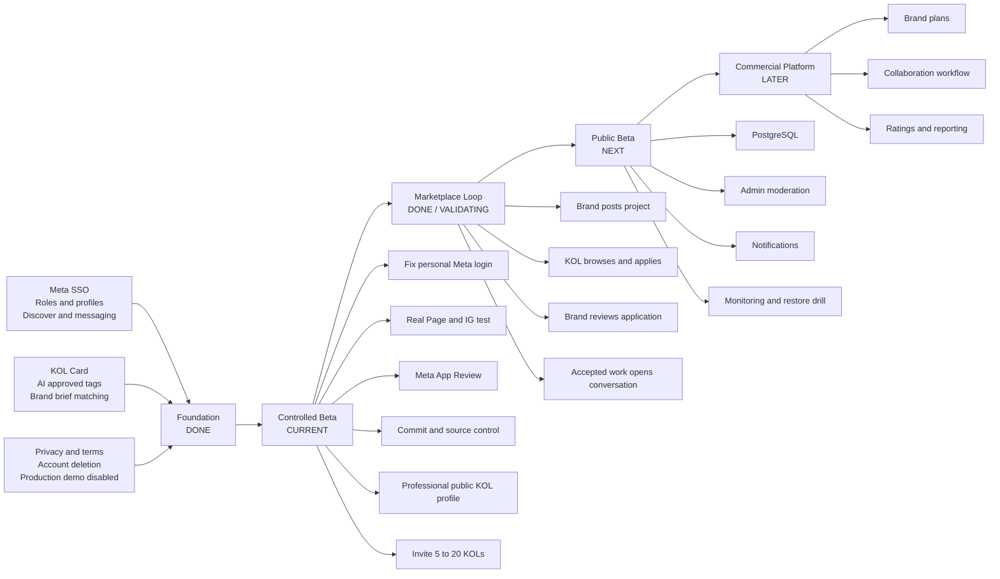
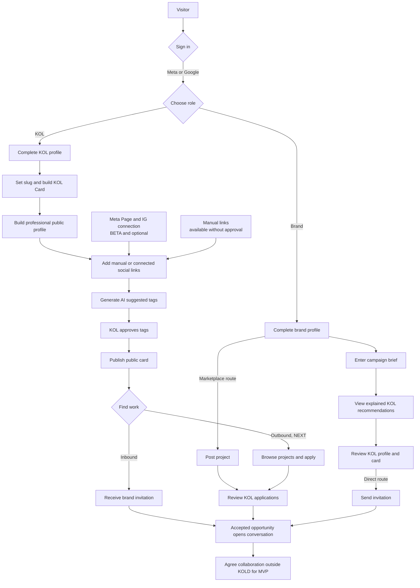
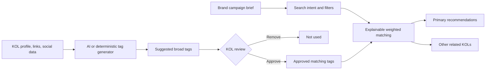

# KOLD Product Roadmap

[繁體中文版](PRODUCT_ROADMAP_ZH_HANT.md)

[Engineering delivery roadmap](ENGINEERING_ROADMAP.md)

Last updated: 2026-09-16

## Product North Star

KOLD helps KOLs build a reusable public identity and helps brands find, invite, and collaborate with suitable creators. The marketplace must work in both directions: brands discover KOLs, while KOLs discover and apply to brand projects.

## Status Legend

- `DONE`: implemented, tested, and deployed.
- `BETA`: implemented but still needs real-user validation or external approval.
- `NEXT`: agreed product direction, not implemented yet.
- `DECISION`: product decision required before implementation.
- `LATER`: intentionally deferred.

## Visual Roadmap

## End-to-End Product Flow

## AI Matching Flow

Sensitive demographic inference remains excluded. An OpenAI failure must fall back to deterministic matching instead of blocking the user journey.

## Delivery Phases

| Phase | Outcome | Included | Exit Criteria | Status |
| --- | --- | --- | --- | --- |
| 0. Foundation | Working two-sided prototype | SSO, roles, profiles, Discover, invitations, conversations | Core tests pass and production is stable | DONE |
| 1. KOL identity | KOL has a shareable reason to register | KOL Card, slug, links, draft preview, publish, AI tag approval | Public card works without Meta approval | DONE |
| 2. Controlled beta | Real users can validate the proposition | Professional public KOL profile, Meta login fix, Page/IG test, App Review preparation, feedback loop | 5-20 invited KOLs publish and share a credible profile | CURRENT |
| 3. Marketplace MVP | KOLs can proactively find work | Project posting, filtered browsing, application, review, accepted conversation | One real brand-to-KOL project loop completes | DONE / VALIDATING |
| 4. Public beta | Safe self-serve onboarding | PostgreSQL, moderation, reporting, notifications, monitoring | External users can join without manual support | NEXT |
| 5. Commercial | Brand-funded sustainable product | Brand plans, limits, analytics, collaboration tracking | Pricing and payment model validated | LATER |

## Current Capability Map

### KOL

| Capability | Status | Remaining Work |
| --- | --- | --- |
| Sign in and choose KOL role | BETA | Resolve personal mobile Meta login; smoke-test Google |
| Create marketplace profile | DONE | Add completion indicator later |
| Build and publish link-in-bio KOL Card | DONE | Baseline already works at `/k/{slug}` |
| Publish professional Linktree-style KOL page | DONE | `/k/{slug}` includes links, portfolio, credibility, rates and Brand CTA |
| Add social links manually | DONE | None for beta |
| Connect Facebook Page / IG Business | BETA | Real account smoke test and Advanced Access |
| Generate and approve AI tags | DONE | Add production OpenAI key for richer output |
| Receive invitation and chat | DONE | Add notification badge/email |
| Browse and apply to projects | DONE | Login required before application |

### Brand

| Capability | Status | Remaining Work |
| --- | --- | --- |
| Sign in and choose Brand role | BETA | Google/Meta external-user smoke test |
| Create brand profile | DONE | Improve completion guidance |
| Discover and filter KOLs | DONE | Add saved shortlist |
| Search from campaign brief | DONE | Production OpenAI key optional; fallback already works |
| Send direct invitation and chat | DONE | Notification and collaboration status |
| Post a project | DONE | Draft, publish and close flow available |
| Review KOL applications | DONE | Accept or decline; accepted applications open collaboration |

### Platform and Operations

| Capability | Status | Remaining Work |
| --- | --- | --- |
| Privacy, terms, data deletion | DONE | Qualified legal review before commercial launch |
| Production demo login disabled | DONE | None |
| PR CI and deployment backup | DONE | CI covers SQLite, PostgreSQL, formatting, build and security; see the engineering roadmap for CD rollback |
| Source control release | IN PROGRESS | Sprint 0 is turning the currently deployed functionality into a traceable release |
| Database | BETA | SQLite is acceptable for controlled beta; migrate before public self-serve |
| Admin moderation and abuse reports | NEXT | Required for public beta |
| Monitoring and alerts | NEXT | Add error and availability monitoring |

## Prioritized Development Backlog

### P0: Finish Controlled Beta

1. Upgrade `/k/{slug}` into the primary Linktree-style public KOL page with professional credibility details.
2. Diagnose personal Meta login failure with the exact mobile error.
3. Enter the published Privacy, Terms, and Data Deletion URLs in Meta Dashboard.
4. Verify basic Meta login with a non-admin account.
5. Test Page/IG connection with a real IG Business or Creator account linked to a Facebook Page.
6. Complete `pages_show_list` and `instagram_basic` App Review material.
7. Commit and push the currently deployed source as a recoverable release.
8. Recruit 5-20 KOLs and record onboarding completion and drop-off points.

### Public KOL Profile Beta Scope

The public `/k/{slug}` page is the main KOL acquisition feature, not a later cosmetic enhancement. It should combine the shareability of Linktree with the credibility of a professional profile.

Required for invited beta:

1. Public display name, editable avatar, headline, bio, niches, regions, and languages. Avatar priority is manual upload, then primary Meta professional account, then sign-in avatar.
2. Selected social channels, handles, follower counts, and verified/connected state where available.
3. Portfolio image grid and selected work links.
4. KOL-approved AI tags grouped into useful categories.
5. Optional visible rate range and collaboration formats.
6. Strong Brand CTA for viewing the marketplace profile or starting a collaboration request.
7. Mobile-first layout, a stable share URL locked on first publication, permanent redirects for operator-assisted renames, and social sharing metadata.
8. KOL visibility controls so private contact data and unapproved AI tags never appear publicly.
9. KOL-selected card layout and accent colour, optional uploaded background, recognizable link icons, and an in-editor preview before publishing. This customization is implemented locally and still needs release review.

The existing authenticated `/u/{user}` page remains the marketplace interaction page. Public visitors use `/k/{slug}`; login is required before sending an invitation or entering a conversation.

### P1: Project Marketplace MVP (implemented; real-flow validation next)

1. Brand project draft, edit, publish, close.
2. Logged-in KOL project list and detail.
3. KOL application with pitch and proposed rate.
4. Brand application inbox with accept and decline.
5. Accepted application creates or reuses a conversation.
6. Permission, ownership, duplicate-application, deadline, and status-transition tests.
7. Complete one real publish, apply, review, accept, and conversation flow with Brand and KOL accounts.
8. Record view-to-application, application-to-acceptance, and submission-failure rates.

### P2: Public Beta Readiness

1. PostgreSQL migration with rollback rehearsal.
2. Admin user role, profile/project hide actions, and abuse reports.
3. Notification badges and essential email notifications.
4. Brand shortlist.
5. Error monitoring, uptime checks, scheduled backups, and restore drill.
6. Rate limiting and basic anti-spam controls.

### P3: Commercial Validation

1. Define free and paid Brand limits.
2. Track collaboration outcome without introducing full CRM complexity.
3. Add brand-side campaign reporting.
4. Decide whether ratings, subscriptions, invoices, or payments belong in KOLD.

## Decision Gates

Development should pause at these gates until the product decision is confirmed:

1. **Launch model:** invited controlled beta first, or immediate public self-serve launch.
2. **Project visibility:** public project pages, or projects visible only to logged-in KOLs.
3. **Marketplace boundary:** KOLD stops after introduction/conversation, or tracks the collaboration through agreed, in-progress, completed, and reviewed states.

## Success Measures

Controlled beta should measure:

- KOL registration completion rate.
- Percentage of KOLs who publish a card.
- Percentage who approve at least one AI tag.
- Brand brief searches that open a KOL profile.
- Invitations sent and accepted.
- Once marketplace exists: project view-to-application and application-to-acceptance rates.

These measures should be aggregate-only for product decisions; individual KOL ranking is not the primary goal.
