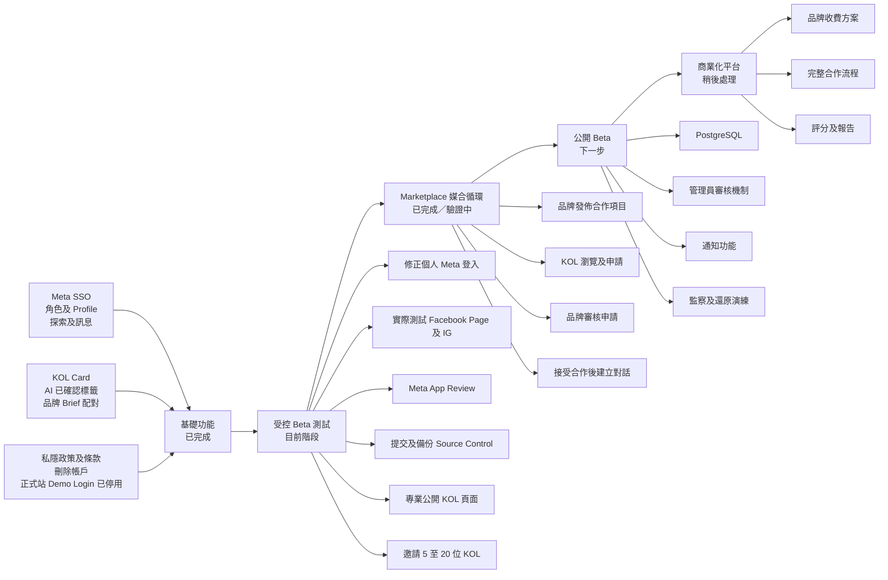
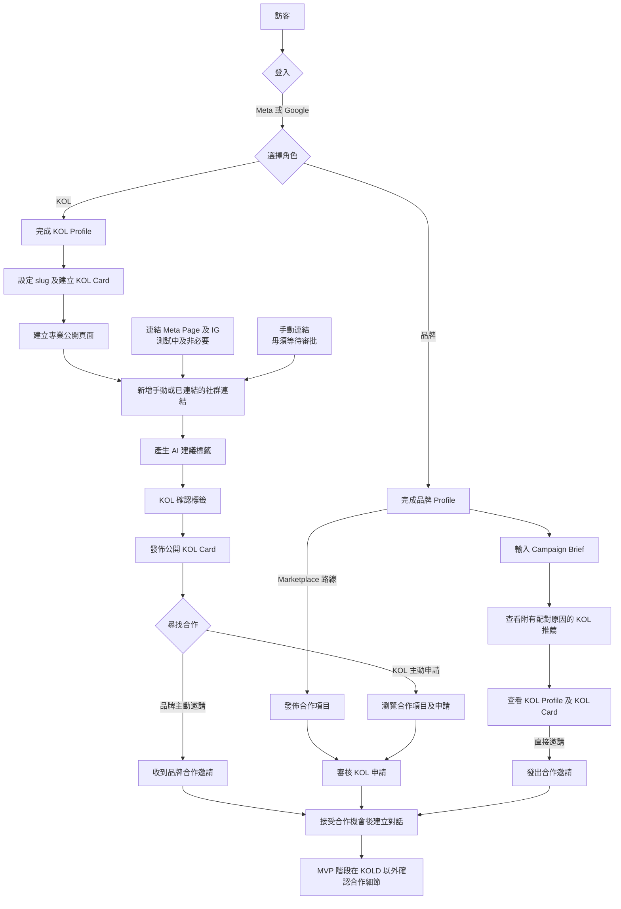
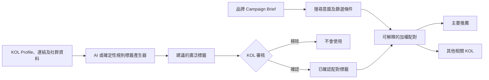

# KOLD 產品路線圖

[English version](PRODUCT_ROADMAP.md)

[工程及交付路線圖](ENGINEERING_ROADMAP.md)

最後更新：2026-09-16

## 產品核心目標

KOLD 協助 KOL 建立可重複使用及公開分享的個人身份頁，同時協助品牌尋找、邀請及與合適的內容創作者合作。平台需要支援雙向媒合：品牌可以發掘 KOL，而 KOL 亦可以發掘及申請品牌合作項目。

## 狀態說明

- `已完成（DONE）`：已開發、測試及部署。
- `測試中（BETA）`：已開發，但仍需要真實用戶驗證或外部審批。
- `下一步（NEXT）`：已確認的產品方向，尚未開發。
- `待決定（DECISION）`：開發前需要先作產品決定。
- `稍後處理（LATER）`：有意延後處理。

## 圖像版產品路線圖

## 完整產品流程

## AI 配對流程

系統不會推斷敏感人口特徵。OpenAI 呼叫失敗時，系統必須自動改用確定性規則配對，不能阻塞用戶流程。

## 交付階段

| 階段 | 目標成果 | 包含功能 | 完成條件 | 狀態 |
| --- | --- | --- | --- | --- |
| 0. 基礎功能 | 可運作的雙邊平台原型 | SSO、角色、Profile、探索、邀請、對話 | 核心測試通過，正式站運作穩定 | 已完成 |
| 1. KOL 身份頁 | 為 KOL 提供值得註冊及分享的功能 | KOL Card、slug、連結、草稿預覽、發佈、AI 標籤確認 | 公開 Card 毋須等待 Meta 審批亦可運作 | 已完成 |
| 2. 受控 Beta | 讓真實用戶驗證產品價值 | 專業公開 KOL 頁、修正 Meta 登入、Page/IG 測試、準備 App Review、收集意見 | 5 至 20 位受邀 KOL 發佈及分享具可信度的 Profile | 目前階段 |
| 3. Marketplace MVP | KOL 可以主動尋找工作 | 發佈項目、篩選瀏覽、申請、審核、接受後建立對話 | 以真實品牌及 KOL 完成一次端對端合作項目流程 | 已完成／驗證中 |
| 4. 公開 Beta | 安全地開放自行註冊 | PostgreSQL、內容審核、舉報、通知、系統監察 | 外部用戶毋須人手協助亦可加入 | 下一步 |
| 5. 商業化 | 建立由品牌端支持的可持續產品 | 品牌方案、用量限制、分析、合作追蹤 | 驗證定價及付款模式 | 稍後處理 |

## 現有功能總覽

### KOL

| 功能 | 狀態 | 尚待處理 |
| --- | --- | --- |
| 登入及選擇 KOL 角色 | 測試中 | 解決手機個人 Meta 登入問題；基本測試 Google 登入 |
| 建立 Marketplace Profile | 已完成 | 稍後加入完成度提示 |
| 建立及發佈 link-in-bio KOL Card | 已完成 | 基本版本已在 `/k/{slug}` 運作 |
| 發佈專業 Linktree 式 KOL 頁面 | 已完成 | `/k/{slug}` 已包括連結、作品、可信資料、報價及品牌行動按鈕 |
| 手動新增社群連結 | 已完成 | Beta 階段毋須再處理 |
| 連結 Facebook Page / IG Business | 測試中 | 實際帳戶測試及申請 Advanced Access |
| 產生及確認 AI 標籤 | 已完成 | 加入正式 OpenAI key，以產生更豐富結果 |
| 接收合作邀請及對話 | 已完成 | 加入通知提示及電郵 |
| 瀏覽及申請合作項目 | 已完成 | 申請前必須登入 |

### 品牌

| 功能 | 狀態 | 尚待處理 |
| --- | --- | --- |
| 登入及選擇品牌角色 | 測試中 | 使用外部用戶基本測試 Google / Meta 登入 |
| 建立品牌 Profile | 已完成 | 改善完成指引 |
| 發掘及篩選 KOL | 已完成 | 加入收藏名單 |
| 使用 Campaign Brief 搜尋 | 已完成 | 正式 OpenAI key 為可選；現時已有 fallback 規則 |
| 發出直接邀請及對話 | 已完成 | 加入通知及合作狀態 |
| 發佈合作項目 | 已完成 | 已有草稿、公開及截止流程 |
| 審核 KOL 申請 | 已完成 | 可接受或拒絕；接受後會建立合作流程 |

### 平台及營運

| 功能 | 狀態 | 尚待處理 |
| --- | --- | --- |
| 私隱政策、使用條款、資料刪除 | 已完成 | 商業推出前進行合資格法律審閱 |
| 停用正式站 Demo Login | 已完成 | 無 |
| PR CI 及部署備份 | 已完成 | CI 包括 SQLite、PostgreSQL、格式、build 及安全檢查；CD rollback 見工程路線圖 |
| Source Control Release | 進行中 | Sprint 0 將目前已部署功能整理成可追溯 release |
| 資料庫 | 測試中 | SQLite 適合受控 Beta；公開自行註冊前遷移至 PostgreSQL |
| 管理員審核及濫用舉報 | 下一步 | 公開 Beta 前必須完成 |
| 系統監察及警報 | 下一步 | 加入錯誤及可用性監察 |

## 優先開發清單

### P0：完成受控 Beta

1. 將 `/k/{slug}` 升級成主要 Linktree 式公開 KOL 頁，並加入專業可信資料。
2. 使用手機的實際錯誤訊息診斷個人 Meta 登入問題。
3. 在 Meta Dashboard 填入已發佈的私隱政策、使用條款及資料刪除 URL。
4. 使用非管理員帳戶驗證基本 Meta 登入。
5. 使用已連結 Facebook Page 的真實 IG Business 或 Creator 帳戶測試 Page/IG 連結。
6. 完成 `pages_show_list` 及 `instagram_basic` 的 App Review 材料。
7. Commit 及 push 目前已部署的程式碼，建立可還原的 release。
8. 招募 5 至 20 位 KOL，記錄 onboarding 完成率及中途退出位置。

### 公開 KOL Profile Beta 範圍

公開 `/k/{slug}` 頁面是吸引 KOL 註冊的主要功能，而不是稍後才處理的外觀改善。它需要同時具備 Linktree 的易分享特性，以及專業 Profile 的可信度。

受邀 Beta 所需功能：

1. 公開顯示名稱、可編輯頭像、headline、個人簡介、內容類別、地區及語言。頭像優先次序為手動上載、主要 Meta 專業帳戶、登入帳戶圖片。
2. 自選社群平台、handle、粉絲數，以及在可行時顯示已驗證或已連結狀態。
3. 作品圖片網格及自選作品連結。
4. 按實用類別顯示經 KOL 確認的 AI 標籤。
5. 可選擇公開參考報價範圍及合作形式。
6. 清晰的品牌行動按鈕，用於查看 Marketplace Profile 或發起合作邀請。
7. Mobile-first 版面、簡潔分享網址及社交分享 metadata。
8. KOL 可控制資料公開程度，確保私人聯絡資料及未確認 AI 標籤不會公開顯示。

現有需要登入的 `/u/{user}` 頁面會保留為 Marketplace 互動頁。公開訪客使用 `/k/{slug}`；發出邀請或進入對話前必須登入。

### P1：Project Marketplace MVP（已完成，進入真實流程驗證）

1. 品牌合作項目草稿、編輯、公開及截止。
2. 已登入 KOL 的合作項目列表及詳情。
3. KOL 使用合作構思及建議報價提交申請。
4. 品牌申請收件匣，可接受或拒絕申請。
5. 接受申請後建立或重用對話。
6. 權限、擁有權、重複申請、截止日期及狀態轉換測試。
7. 使用真實品牌及 KOL 帳戶完成一次發佈、申請、審核、接受及對話流程。
8. 記錄項目瀏覽至申請、申請至接受及提交失敗率。

### P2：公開 Beta 準備

1. PostgreSQL 遷移及 rollback 演練。
2. 管理員角色、隱藏 Profile／Project，以及濫用舉報。
3. 通知提示及必要電郵通知。
4. 品牌 KOL 收藏名單。
5. 錯誤監察、uptime check、定期備份及還原演練。
6. Rate limiting 及基本防垃圾訊息機制。

### P3：商業模式驗證

1. 定義免費及付費品牌方案的用量限制。
2. 在不建立完整 CRM 的前提下追蹤合作結果。
3. 加入品牌端 Campaign 報告。
4. 決定評分、訂閱、發票或付款功能是否適合加入 KOLD。

## 產品決策關卡

開發到以下關卡時，應先確認產品決定再繼續：

1. **推出模式：** 先進行受邀的受控 Beta，或立即公開讓用戶自行註冊。
2. **合作項目可見度：** 公開顯示合作項目頁面，或只讓已登入 KOL 查看。
3. **Marketplace 邊界：** KOLD 在介紹及對話後停止追蹤，或繼續追蹤「已確認、進行中、已完成及已評價」等合作狀態。

## 成效指標

受控 Beta 應量度：

- KOL 註冊完成率。
- 發佈 KOL Card 的 KOL 比例。
- 確認最少一個 AI 標籤的 KOL 比例。
- 品牌 Brief 搜尋後開啟 KOL Profile 的次數。
- 已發出及已接受的合作邀請數量。
- Marketplace 推出後：合作項目瀏覽至申請轉換率，以及申請至接受轉換率。

以上指標只應以匯總方式用於產品決策；平台的主要目標並非為個別 KOL 排名。
